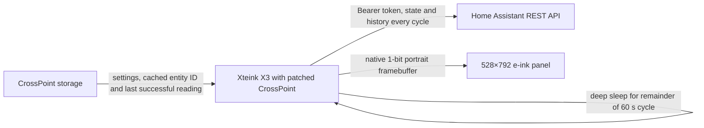

# Architecture

The X3 is the only runtime component. It connects to saved Wi-Fi, reads Home
Assistant, renders the frame locally, powers Wi-Fi down, and deep-sleeps for the
remainder of a 60-second cycle. Network and rendering time are deducted from
the sleep interval; when a cycle itself exceeds 60 seconds, the next wake is
scheduled one second later. SugarTV adds the timer wake source, then delegates
the final transition to CrossPoint's `HalPowerManager::startDeepSleep()`. This
keeps CrossPoint's serial teardown, power-rail shutdown, and power-button wake
handling in the device's canonical sleep lifecycle.

Timer wakes use a silent path. The retained e-ink frame stays visible while
CrossPoint initializes and reconnects, so automatic updates do not show a boot
logo or Wi-Fi progress screen. Manual entry from the CrossPoint home menu still
shows status and permits backing out. The display is always forced to portrait
orientation.

Each successful cycle stores the small normalized reading record and its fetch
time in `/.crosspoint/sugartv-reading.json`. If Wi-Fi connection, Home Assistant
access, or the selected sensor fails on a later cycle, the renderer uses that
record instead of silently retaining an apparently current frame. The cached
value, trend, delta, displayed age, and battery percentage are frozen. The
upper-left single-line status normally reads `Updated` with the absolute local
time of the successful cycle; on failure it changes to `Update failed` with the
absolute local time of the failed attempt. The next timer wake retries the
normal data path. With no cached success, the main value is `N/A`.

Headless Wi-Fi reconnect first tries the last successful saved network. An
early cold-radio failure falls back to a fresh scan of visible saved networks;
the original network receives one additional attempt only when that scan
confirms it is reachable. The explicit one-shot retry state keeps the workflow
bounded across unavailable or changing networks. Manual selection automatically
stores an open network as an empty-password credential; otherwise the headless
path would see its SSID but have no saved network it is allowed to join.

An RTC marker records that SugarTV owns the next scheduled wake. A short
power-button press wakes the X3, runs an immediate SugarTV update, and re-arms
the next minute. A verified power-button hold clears the marker and returns to
the normal CrossPoint UI.

## Home Assistant data flow

The default source resolver streams `/api/states` rather than buffering the
full response. It selects the first valid `sensor.*` entity with
`device_class: blood_glucose_concentration`, then stores that ID in
`/.crosspoint/sugartv-entity.txt`. An explicit `glucose_value` setting wins.
The cache is invalidated only after an HTTP request failure; `unknown` and
`unavailable` are valid responses from the selected source and stay associated
with it.

Trend resolution follows the card's priority order: explicit entity, known
Dexcom/Carelink sibling names, Libre-style sibling name, `direction` attribute,
then `trend` attribute. Timestamp resolution follows the configured attribute,
`measurement_timestamp`, guarded Nightscout fields, Carelink or LibreLink
sibling sensors, and finally `last_updated` or `last_changed`.

The device requests 25 minutes of recorder history. Valid timestamps determine
the typical sensor cadence using the lower median of gaps of at least one
minute. The nearest suitable reading around five minutes earlier supplies the
delta. Missing history leaves the current value usable, shows a progress-clock
glyph instead of a delta, and falls back to a five-minute cadence.

## Settings contract

The JSON settings contract reuses the card's `glucose_value`, `glucose_trend`,
`timestamp_attribute`, `show_prediction`, `relative_time`, `dim_by_age`,
`color_thresholds`, and `thresholds` names. Partial threshold objects merge
with unit-specific defaults before their strict ordering is validated. The X3
adds `show_age_states` because the one-bit display needs a separate switch for
age dithering, and `decimal_comma` because it has no Home Assistant frontend
locale from which to derive number formatting.

## Rendering states

The renderer ports the card's portrait hierarchy and English prediction copy.
Firmware and local preview execute the same hardware-independent C++ renderer,
using the same 1-bit pixel primitives, bitmap fonts, layout constants, and icon
assets. Only the final canvas adapter differs: the X3 rotates logical portrait
pixels into its physical framebuffer, while the host writes a PBM image for
inspection. Every render reports clipped-pixel count, ink bounds, and a CRC32;
the visual matrix fails if any state writes outside 528×792.

The pending-delta clock is rasterized from the versioned
`mdi:progress-clock` SVG used by the Home Assistant card rather than being
approximated with arcs. A golden SHA-256 locks the default frame, while explicit
pixel assertions lock the clock's continuous right edge and broken left edge.

The dedicated-device default shows reading age (`now`, `3 min ago`) instead
of absolute measurement time; `relative_time: false` restores the clock form.
Normal readings are black on white. Low and high readings add a border. Urgent
low and urgent high readings invert the frame. When age-state visualization is
enabled, aging is dithered only with `dim_by_age` and stale data is always
dithered. Battery percentage and any failed-attempt status are drawn afterward
so they remain legible.

Age-state visualization is disabled by default on the dedicated device, so
aging and stale readings retain full ink density while their textual age keeps
advancing. Setting `show_age_states: true` restores stale dithering and permits
the optional aging fade controlled by `dim_by_age`.

Threshold visualization is disabled by default on the dedicated device, so all
glucose zones use the normal black-on-white composition. Setting
`color_thresholds: true` restores the border and inversion mapping above.

The value remains visually centered whether prediction text is present or not.
Supported readings include mg/dL and mmol/L, including an optional decimal
comma. Missing values render as English `N/A`, with the same Material Design
Icons trend glyphs as SugarTV Card, the
`mdi:help-circle-outline` unknown-trend icon, and a pending delta clock.

## Trust boundary

Direct operation moves the Home Assistant long-lived token onto the X3. The
token is supplied at build time and is present in the private firmware binary;
it must not appear in tracked source, patches, logs, screenshots, or fixtures.
An HTTP Home Assistant URL sends the bearer token in cleartext. HTTPS without
certificate validation would encrypt traffic but would not authenticate the
server, so a production deployment needs an explicit certificate-validation or
pinning design.

Transport selection is scheme-specific. Plain `http://` requests use ESP-IDF's
`esp_http_client`; `https://` requests use CrossPoint's wolfSSL client. Routing
plain HTTP through the TLS-oriented wrapper causes a connection timeout and was
rejected by the first hardware-cycle test.

A short USB-connected multi-cycle soak passed after the canonical sleep fix.
The required disconnected run and long-term battery life are not yet measured
on the target device. The current implementation should be treated as a
recoverable device test until wake reliability, Home Assistant failure
behavior, display ghosting, and battery drain have been observed over time.
